# Crunchy Database Deployment Workflow via GitHub Actions

This GitHub Actions workflow automates the deployment and management of a Crunchy PostgreSQL database instance within an OpenShift environment. It's designed to support application development workflows, particularly by providing isolated database instances for Pull Requests and ensuring resources are cleaned up afterwards.

## Features

- **PostgreSQL Support** with PostGIS extensions (optional)
- **High Availability** configuration with multiple replicas
- **Backup & Recovery** options using both PVC and S3 storage
- **PR-based Isolated Databases** for development workflows
- **Automatic Resource Cleanup** when PRs are closed
- **Monitoring Integration** with Prometheus

## Workflow Overview

Here's a breakdown of the main phases:

### Generate Release Name

*   This initial step creates a unique identifier for the Crunchy database deployment.
*   It takes the repository name and generates a short hash from it, prefixing it with `pg-`. This ensures deployments are named consistently but uniquely per repository, which is helpful in a shared OpenShift namespace.
*   The generated name is then used in subsequent steps to reference the specific Crunchy cluster.

### Deploy Database

*   This is the core deployment step, utilizing the `bcgov/action-oc-runner` action to interact with the target OpenShift cluster.
*   It prepares a Crunchy Helm chart (adjusting the name in `Chart.yaml`) and packages it.
*   It then uses `helm upgrade --install` to deploy or update the Crunchy PostgreSQL cluster.
*   **Importantly**, it includes logic to conditionally enable and configure S3 backups based on provided inputs.
*   Post-deployment, the workflow includes a wait loop that checks the status of the Crunchy cluster's primary database instance (`db`) to ensure it becomes ready before proceeding. This confirms the operator has successfully provisioned the database.

### Add PR Specific User (Conditional)

*   This step only runs when the workflow is triggered by a Pull Request.
*   Its purpose is to create a dedicated PostgreSQL user and a corresponding database within the deployed Crunchy cluster specifically for that Pull Request (named `app-<PR_number>`).
*   It works by patching the `PostgresCluster` OpenShift resource to add the new user to its specification. The Crunchy operator then sees this change and provisions the user and database.
*   A waiting mechanism is included to ensure the corresponding Kubernetes `Secret` containing the user's credentials is created by the operator before the step finishes. This dedicated user/database setup helps in isolating development environments for different PRs.

### Cleanup Job

*   This separate job is designed to remove resources created by the workflow. It's triggered when a Pull Request is closed or merged, or when the `force_cleanup` input is set to true.
*   For the Crunchy deployment, it identifies the specific `PostgresCluster` based on the generated release name.
*   It then removes the PR-specific user from the `PostgresCluster` definition by patching the resource.
*   Finally, it connects to the primary PostgreSQL pod using `oc exec` and executes `psql` commands to terminate existing connections to the PR database, and then drops both the dedicated PR database and the PR user role within PostgreSQL.
*   This cleanup is essential for managing resources and preventing resource sprawl when using PR-based deployments.

```mermaid
%%{
    init: {
        'theme': 'base',
        'themeVariables': {
            'primaryColor': '#f8f8f8',
            'primaryTextColor': '#333',
            'primaryBorderColor': '#ddd',
            'lineColor': '#666',
            'secondaryColor': '#eee',
            'tertiaryColor': '#fff'
        },
        'flowchart': {
            'curve': 'basis'
        }
    }
}%%
graph TD
        subgraph "Deployment Phase"
                A[Start]
                B(Generate Release Name);
                C(Deploy Database using Helm);
                D{Wait for Primary DB Ready};
                E{Is this a PR Trigger?};
                F(Add PR Specific User/DB);
                G(Wait for User Secret);
                H(Deployment Complete);

                B --> C;
                C --> D;
                D --> E;
                E -- Yes --> F;
                F --> G;
                G --> H;
                E -- No --> H;
        end

        subgraph "Cleanup Phase (PR Close)"
                I[Start Cleanup];
                J(Identify PostgresCluster);
                K(Patch PostgresCluster - Remove PR User);
                L(Connect to Primary Pod);
                M(Terminate Connections to PR DB);
                N(Drop PR Database);
                O(Drop PR User Role);
                P[Cleanup Complete];

                I --> J;
                J --> K;
                K --> L;
                L --> M;
                M --> N;
                N --> O;
                O --> P;
        end

        A --> B;

        classDef default fill:#f9f9f9,stroke:#333,stroke-width:1px;
        classDef condition fill:#fffbe6,stroke:#ffe58f,stroke-width:1px;
        classDef action fill:#e6fffb,stroke:#87e8de,stroke-width:1px;
        classDef wait fill:#fff7e6,stroke:#ffd591,stroke-width:1px;
        classDef startEnd fill:#f0f0f0,stroke:#555,stroke-width:2px,font-weight:bold;

        class A,I,H,P startEnd;
        class E condition;
        class B,C,F,J,K,L,M,N,O action;
        class D,G wait;
```



## Configuration Options

The action accepts the following inputs:

### Required Inputs

| Input | Description |
|-------|-------------|
| `oc_namespace` | OpenShift namespace where the database will be deployed |
| `oc_token` | OpenShift token for authentication |
| `values_file` | Path to the values.yml file to use for the deployment |

### Optional Inputs

| Input | Description | Default |
|-------|-------------|---------|
| `environment` | Environment name (omit for PRs) | |
| `triggers` | Paths used to trigger a deployment (e.g., ./backend/ ./frontend/) | |
| `oc_server` | OpenShift server URL | https://api.silver.devops.gov.bc.ca:6443 |
| `s3_access_key` | S3 access key for backups | |
| `s3_secret_key` | S3 secret key for backups | |
| `s3_bucket` | S3 bucket for backups | |
| `s3_endpoint` | S3 endpoint for backups | |
| `force_cleanup` | Force cleanup of the database | false |
| `directory` | Directory containing the Crunchy chart | charts/crunchy |
| `repository` | GitHub repository (e.g., org/repo) | bcgov/action-crunchy |
| `ref` | Git ref to use (e.g., branch, tag, SHA) | main |
| `release_name` | The release name to use, if provided overrides the computed pg-md5hash(1-8) of github repo name | |

### Outputs

| Output | Description |
|--------|-------------|
| `release` | The provided or generated release name |
| `cluster` | The name of the deployed cluster |

## Sample Usage in GitHub Actions

### Basic Deployment with PVC Backup

The following example demonstrates how to deploy a Crunchy PostgreSQL database with backup functionality using Persistent Volume Claims (PVC):

```yaml
name: Deploy Crunchy Database

on:
  pull_request:
    types: [opened, synchronize, reopened]
  push:
    branches:
      - main

jobs:
  deploy-crunchy-db:
    runs-on: ubuntu-latest
    steps:
      - name: Checkout
        uses: actions/checkout@v4
      
      - name: Deploy Crunchy
        uses: bcgov/action-crunchy@v1.1.0
        id: deploy_crunchy
        with:
          oc_namespace: ${{ secrets.OC_NAMESPACE }}
          oc_token: ${{ secrets.OC_TOKEN }}
          environment: ${{ inputs.environment }}
          values_file: charts/crunchy/values.yml
          triggers: ${{ inputs.triggers }}
```

### Deployment with S3 Backups

This example extends the deployment to include S3-based backup functionality:

```yaml
name: Deploy Crunchy Database

on:
  pull_request:
    types: [opened, synchronize, reopened]
  push:
    branches:
      - main

jobs:
  deploy-crunchy-db:
    runs-on: ubuntu-latest
    steps:
      - name: Checkout
        uses: actions/checkout@v4
      
      - name: Deploy Crunchy
        uses: bcgov/action-crunchy@v1.1.0
        id: deploy_crunchy
        with:
          oc_namespace: ${{ secrets.OC_NAMESPACE }}
          oc_token: ${{ secrets.OC_TOKEN }}
          environment: ${{ inputs.environment }}
          values_file: charts/crunchy/values.yml
          triggers: ${{ inputs.triggers }}
          s3_access_key: ${{ secrets.S3_ACCESS_KEY }}
          s3_secret_key: ${{ secrets.S3_SECRET_KEY }}
          s3_bucket: ${{ secrets.S3_BUCKET }}
          s3_endpoint: ${{ secrets.S3_ENDPOINT }}
```

## Backup and Recovery

The Crunchy deployment supports two backup methods:

### PVC-based Backups (Default)
- Uses Persistent Volume Claims for storing backups
- Configured for 1 day retention of full backups
- Full backups scheduled daily at 8:00 UTC
- Incremental backups scheduled every 12 hours

### S3-based Backups (Optional)
- Uses S3-compatible object storage
- Configured for 7 days retention of full backups
- Full backups scheduled daily at 9:00 UTC
- Incremental backups scheduled every 5 hours

To enable or restore from backups, adjust the configuration in your values.yml file:

```yaml
# Cloning from backups in object store
clone:
  enabled: true
  s3:
    enabled: true
  path: '/backups/cluster/version/1' # make sure this bucket path points to a valid backup location.

# Cloning from backups in pvc
clone:
  enabled: true
  pvc:
    enabled: true
    clusterName: 'existing crunchy cluster name in the namespace'

# Point-in-time recovery
restore:
  repoName: 'repo1' # for pvc 'repo2' for object store
  enabled: true
  target: '2024-03-24 17:16:00-07'
```

## Best Practices

- Replace `bcgov/action-crunchy@v1.1.0` with a specific commit SHA for better reproducibility
- Ensure all required secrets are properly configured in your repository's settings
- Customize the values.yml file based on your application's needs
- For production deployments, adjust the resource requests and limits accordingly
- **Never** reuse the same S3 bucket path across different environments

> **Important**: <b><i><u>Never reuse the same s3/object store, bucket path across different Crunchy deployments or instances (dev, test, prod)</b></i></u>

## Troubleshooting and Support

If you encounter issues, check out the [Troubleshooting Guide](https://github.com/bcgov/crunchy-postgres/blob/main/Troubleshoot.md) for quick solutions.

Need more help? Join the discussion in the [CrunchyDB Rocket.Chat Channel](https://chat.developer.gov.bc.ca/channel/crunchydb) to get support from the community and experts.